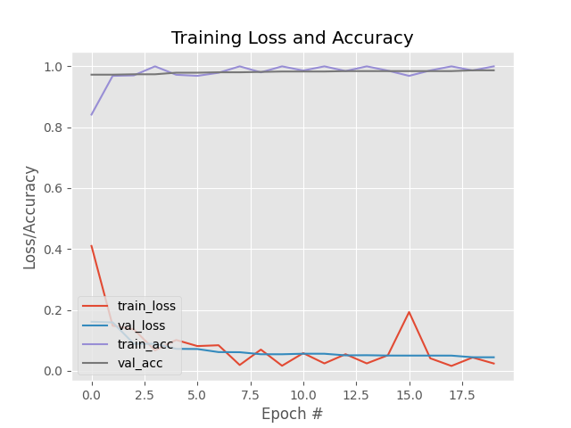

# Face Mask Detection

Real-time face mask detection from a webcam. A MobileNetV2 classifier, fine-tuned on about 3,800 labelled face images, decides for every detected face whether it wears a mask and draws a green (mask) or red (no mask) box with the confidence.



In the included training run the model reached about 98–99% validation accuracy.

## How it works

**Training** (`train_mask_detector.py`)

- Loads the images in `dataset/with_mask` and `dataset/without_mask`, resized to 224×224
- Splits them 80/20 (stratified) into training and validation sets
- Augments the training images with rotation, zoom, shifts, shear and horizontal flips
- Uses MobileNetV2 pre-trained on ImageNet as a frozen base, with a new head (average pooling → dense 128 → dropout 0.5 → softmax over 2 classes)
- Trains for 20 epochs (Adam, learning rate 1e-4, batch size 32), prints a classification report and saves `mask_detector.h5` and `plot.png`

**Detection** (`detect_mask_video.py`)

- Finds faces in each webcam frame with OpenCV's DNN face detector (ResNet-10 SSD, `face_detector/`), keeping detections above 50% confidence
- Classifies each face crop with the trained model and labels it "Mask" or "No Mask" with its probability
- Press `q` to quit

## Tech stack

Python · TensorFlow / Keras · MobileNetV2 · OpenCV · scikit-learn · imutils · Matplotlib

## Getting started

Requires Python 3.9+ and a webcam.

```bash
python -m venv .venv && source .venv/bin/activate   # Windows: .venv\Scripts\activate
pip install -r requirements.txt scikit-learn
python detect_mask_video.py      # run live detection with the included model
python train_mask_detector.py    # optional: retrain on the dataset
```

## Project structure

```
train_mask_detector.py   Fine-tune MobileNetV2 and save the model
detect_mask_video.py     Live webcam detection
mask_detector.h5         Trained mask classifier
face_detector/           OpenCV face detection model (prototxt + Caffe weights)
dataset/                 Training images: with_mask/ and without_mask/
plot.png                 Training loss and accuracy
```
